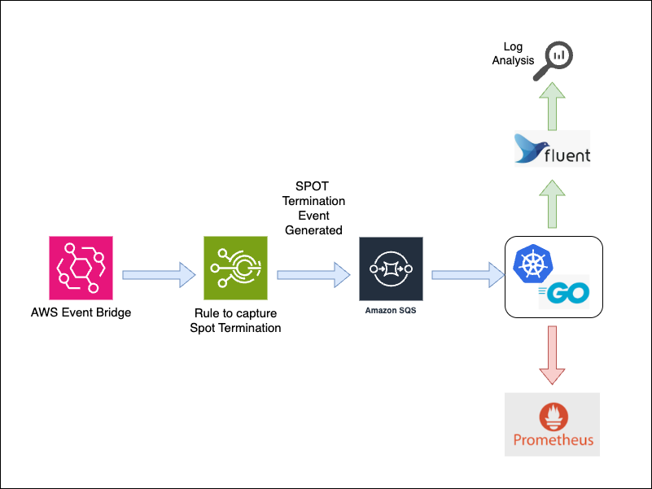
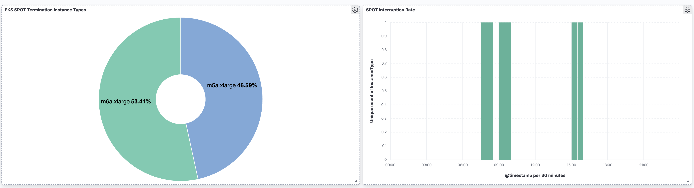
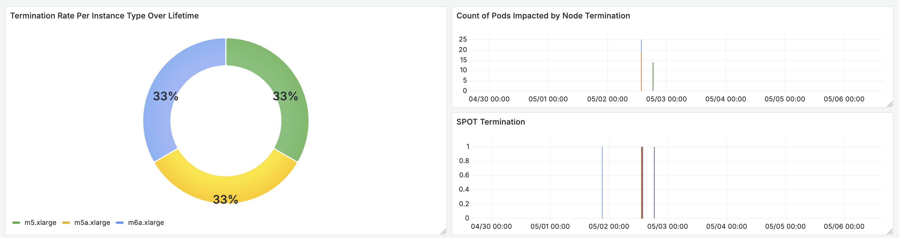
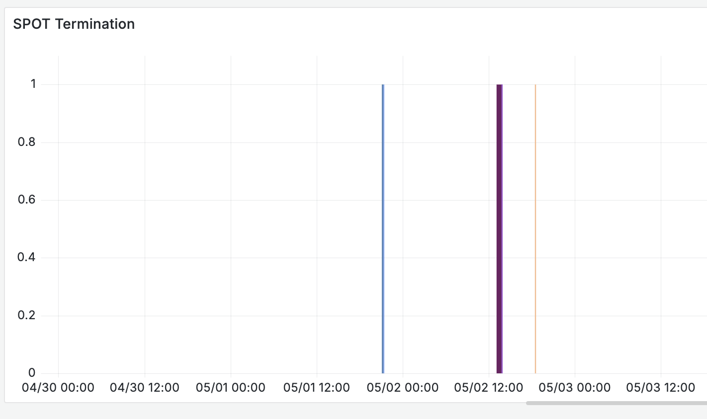
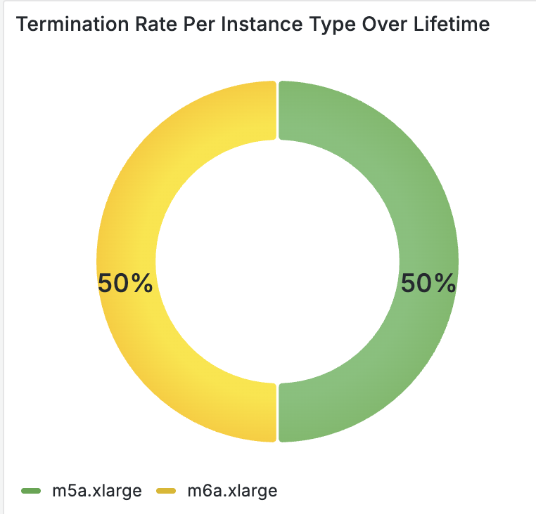
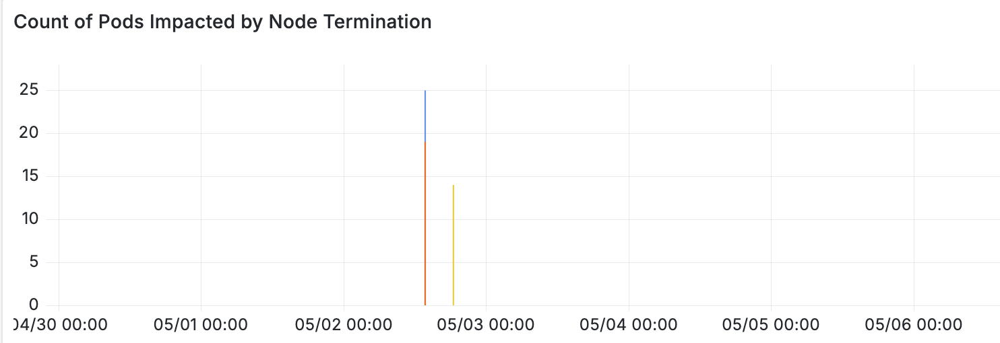

# eks-spot-termination-monitor

`eks-spot-termination-monitor` is a lightweight Go service that runs inside an EKS cluster to monitor and expose metrics for EC2 Spot Instance interruption notices. These metrics are designed to be scraped by Prometheus and used to create real-time alerts and dashboards for node termination events.

---

## 🚀 Features

- Monitors the EC2 Spot Instance interruption endpoint on EKS worker nodes.
- Exposes Prometheus metrics to track:
  - Total number of interruptions by instance type and node.
  - Last seen interruption timestamp.
- Minimal overhead and suitable for daemonset deployment on all nodes.

---

## 📦 Project Architecture


## 🛠️ Prerequisites
- Kubernetes cluster (EKS recommended)
- Prometheus for metrics scraping
- Spot Nodes running in the cluster

## 🚀 Getting Started

## 1. Setup AWS Infrastructure

### Create IAM Policy
This Permissions will be used by:
- EventBridge to send messages to SQS queue.
- Application to receive messages from SQS queue.
- Application to describe EC2 instances and get further info.
- Application to delete messages from SQS queue.

Save the policy JSON to a file `eks-spot-termination-monitor-policy.json` and run:

```json
{
    "Statement": [
        {
            "Action": [
                "sqs:SendMessage",
                "sqs:ReceiveMessage",
                "sqs:DeleteMessage",
                "sqs:GetQueueAttributes",
                "sqs:GetQueueUrl"
            ],
            "Effect": "Allow",
            "Resource": [
                "arn:aws:sqs:<AWS REGION>:<AWS ACCOUNT ID>:eks-spot-termination-monitor"
            ],
            "Sid": "SQSPermissions"
        },
        {
            "Action": [
                "ec2:List*",
                "ec2:Describe*"
            ],
            "Effect": "Allow",
            "Resource": "*",
            "Sid": "ec2Permissions"
        }
    ],
    "Version": "2012-10-17"
}

```
Create IAM Policy with given command:
```bash
aws iam create-policy \
  --policy-name eks-spot-termination-monitor-policy \
  --policy-document file://eks-spot-termination-monitor-policy.json
```

### Create IAM Role
Create IAM Role with the following trust relationship

> ℹ️ **Info:**
> Replace `<AWS ACCOUNT>` and `<OIDC PROVIDER ID>` with your AWS account ID and OIDC provider ID respectively.
> If you are deploying the application in other namespace than `kube-system`, replace `kube-system` with your namespace.

`eks-spot-termination-monitor-trust-policy.json`
```json
{
    "Version": "2012-10-17",
    "Statement": [
        {
            "Effect": "Allow",
            "Principal": {
                "Service": "events.amazonaws.com"
            },
            "Action": "sts:AssumeRole"
        },
        {
            "Effect": "Allow",
            "Principal": {
                "Federated": "arn:aws:iam::<AWS ACCOUNT>:oidc-provider/oidc.eks.eu-west-1.amazonaws.com/id/<OIDC PROVIDER ID>"
            },
            "Action": "sts:AssumeRoleWithWebIdentity",
            "Condition": {
                "StringEquals": {
                    "oidc.eks.eu-west-1.amazonaws.com/id/<OIDC PROVIDER ID>:sub": "system:serviceaccount:kube-system:eks-spot-termination-monitor"
                }
            }
        }
    ]
}
```

Create IAM Role with given command:
```bash
aws iam create-role \
  --role-name eks-spot-termination-monitor \
  --assume-role-policy-document file://eks-spot-termination-monitor-trust-policy.json

```

### Attach IAM Policy to IAM Role
```bash
aws iam attach-role-policy \
  --role-name eks-spot-termination-monitor \
  --policy-arn arn:aws:iam::<AWS ACCOUNT>:policy/eks-spot-termination-monitor-policy

```

### Create SQS Queue
```bash
aws sqs create-queue \
  --queue-name eks-spot-termination-monitor \
  --attributes VisibilityTimeout=600 \
  --tags environment=prod system=eks-spot-termination-monitor team=cloud
```

### Create EventBridge Rule
This rule will trigger on EC2 Spot Instance Interruption Warnings and send messages to the SQS queue created above.
```bash
aws events put-rule \
  --name "eks-spot-termination-monitor" \
  --event-pattern '{
    "source": ["aws.ec2"],
    "detail-type": ["EC2 Spot Instance Interruption Warning"]
  }' \
  --state ENABLED \
  --description "Triggers on EC2 Spot Instance Interruption Warnings"

```
### Add Target to EventBridge Rule
Add Sqs queue as target to the EventBridge rule created above.
>ℹ️ **Info:**
> Replace `<region>` and `<account-id>` with your AWS region and account ID respectively.

```bash
aws events put-targets \
  --rule "eks-spot-termination-monitor" \
  --targets "[
    {
      \"Id\": \"SendToSQS\",
      \"Arn\": \"arn:aws:sqs:<region>:<account-id>:eks-spot-termination-monitor\",
      \"RoleArn\": \"arn:aws:iam::<account-id>:role/eks-spot-termination-monitor\"
    }
  ]"

```

## 2. Deploy Application in EKS Cluster

### Define your values in values.yaml
- Go to `k8s/values.yaml` and define your values.
> ℹ️ **Info:**
> You can use the default values provided in `k8s/values.yaml` file unless you want to change the SQS polling interval or the Prometheus scrape interval.


```
helm repo add eks-spot-termination-monitor
helm repo update
helm upgrade --install eks-spot-termination-monitor \
eks-spot-termination-monitor/eks-spot-termination-monitor \
  --namespace kube-system \
  . -f values.yaml
```

### Verify the Application
```bash
>> kubectl get pods -n kube-system -l app=eks-spot-termination-monitor

eks-spot-termination-monitor-74d97876cf-8kvsz  1/1     Running   0  25s

```

### Check the logs
Logs contain useful information about:
1. Name of Pods Impacted.
2. Instance Type.
3. Node Name.
4. Instance ID.
5. Instance architecture.
6 timestamp of the interruption.

Sample Log:
```bash
{"EC2SPOTEvent":"terminate","ImpactedPod":"alpha-safrwg-1235f34","InstanceArch":"x86_64","InstanceID":"i-07186901d1e551247","InstanceState":"terminating","InstanceType":"m5a.xlarge","NodeName":"ip-172-83-122-224.us-east-1.compute.internal","PodNamespace":"alpha","PodState":"Terminating","level":"info","msg":"SPOT termination captured","time":"2025-05-08T07:46:23Z"}
```

Dashboard from logs in Kibana:


### Check the metrics
Dashboard from logs in Kibana:


Prometheus Queries to get the metrics:

- Interruptions with respect to time:
```prometheus
eks_spot_interruption_last_seen
```


- Most interrupted instance types:
```prometheus
sum(eks_spot_interruptions_by_instance_type_over_lifetime) by (instance_type)
```


- Number of pods impacted:
```prometheus
eks_spot_interruptions_pods_impacted_per_termination
```


## References:
- https://docs.aws.amazon.com/AWSEC2/latest/UserGuide/spot-instance-termination-notices.html
- https://aws.amazon.com/blogs/compute/taking-advantage-of-amazon-ec2-spot-instance-interruption-notices/